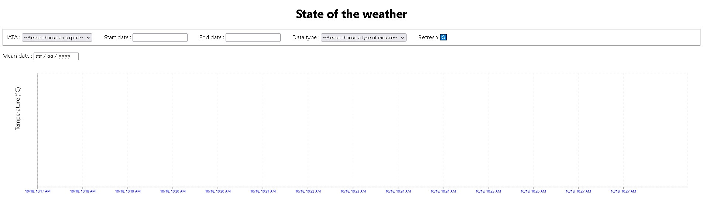
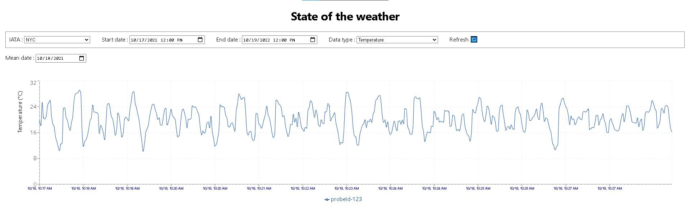

# ARCHI weather airport client

This is a [Next.js](https://nextjs.org/) project bootstrapped with [`create-next-app`](https://github.com/vercel/next.js/tree/canary/packages/create-next-app).

It allows an user to view on a web interface data from a redis database fullfilled by weather sensors. More details about this project is available at the following page : [ARCHI weather airport server](https://github.com/Naedri/ARCHI-weather-airport-server).

## Getting Started

First, add a _.env.local_ file , containing the address of the database server `NEXT_PUBLIC_API`, for example : 

```
NEXT_PUBLIC_API=http://localhost:8080
```

Then, run the client server:

```bash
npm install
npm run build
npm start
```

Open [http://localhost:3000](http://localhost:3000) with your browser to see the result, which should start with this : 

<p></p>

After data acquisition by [ARCHI weather airport server](https://github.com/Naedri/ARCHI-weather-airport-server), data variations will be represented by a line chart, such as the following  :

<p></p>
